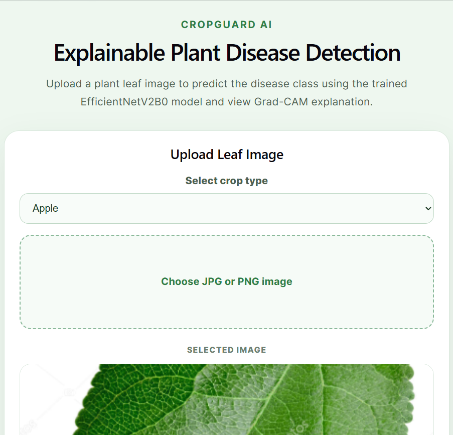
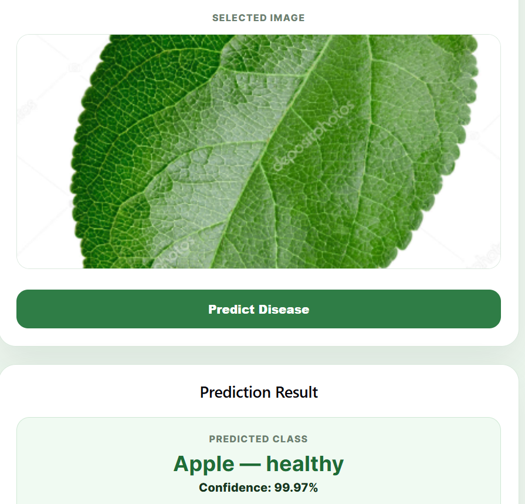
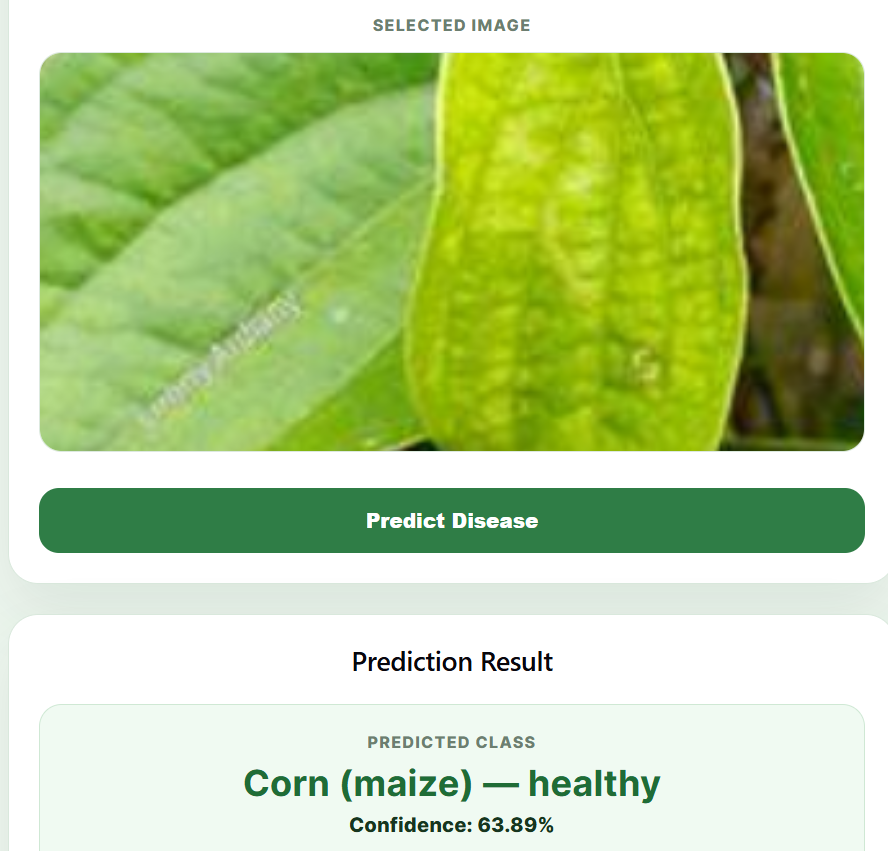
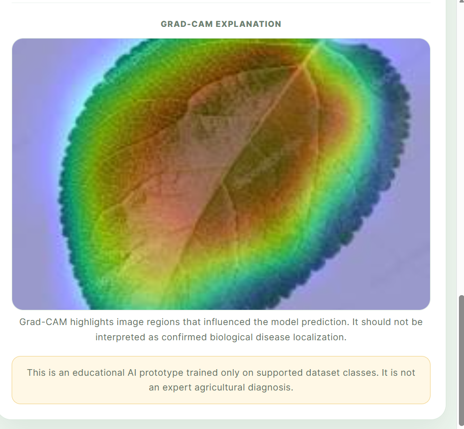
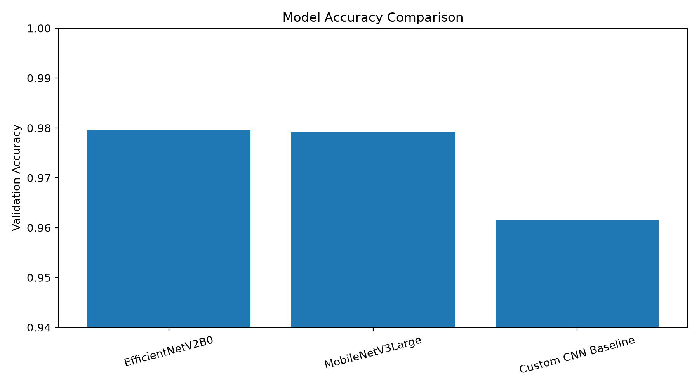
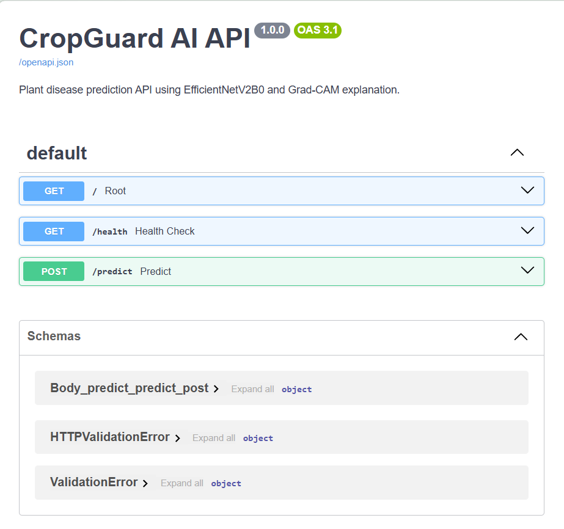

# CropGuard AI — Full-Stack Explainable Plant Disease Detection System

CropGuard AI is a full-stack deep learning project for plant disease classification using convolutional neural networks, transfer learning, FastAPI, React, and Grad-CAM explainability.

The system allows users to upload a plant leaf image, predicts the most likely disease class using a trained deep learning model, displays top-3 predictions with confidence scores, and generates a Grad-CAM heatmap to highlight image regions that influenced the model prediction.

This project is built as an educational AI prototype and portfolio project. It is not intended to replace expert agricultural diagnosis.

---

## Project Highlights

* Trained and compared three CNN-based models:

  * Custom CNN baseline
  * EfficientNetV2B0 transfer learning model
  * MobileNetV3Large lightweight comparison model
* Selected EfficientNetV2B0 as the best model based on validation accuracy and macro F1-score.
* Built a FastAPI backend for image prediction and Grad-CAM generation.
* Built a React frontend for image upload, prediction display, and Grad-CAM visualization.
* Added confidence-based uncertainty handling.
* Added crop-aware validation to detect crop mismatch cases.
* Added pytest backend tests for health check, prediction, invalid file handling, crop match, and crop mismatch.

---

## Demo Screenshots

### Frontend Upload Page



### Prediction Result



### Crop Mismatch / Uncertain Prediction



### Grad-CAM Explanation



### Model Comparison



### FastAPI Docs



---

## Model Performance

The models were trained and evaluated on the Kaggle New Plant Diseases Dataset containing 38 plant disease classes.

| Model               | Role                                  | Accuracy | Macro F1 | Weighted F1 | Top-3 Accuracy |   Loss |
| ------------------- | ------------------------------------- | -------: | -------: | ----------: | -------------: | -----: |
| EfficientNetV2B0    | Main transfer learning model          |   0.9796 |   0.9794 |      0.9795 |         0.9987 | 0.0675 |
| MobileNetV3Large    | Lightweight deployment-friendly model |   0.9792 |   0.9790 |      0.9792 |         0.9986 | 0.0618 |
| Custom CNN Baseline | Baseline model trained from scratch   |   0.9614 |   0.9624 |      0.9619 |         0.9976 | 0.1153 |

Best model: **EfficientNetV2B0**

---

## Dataset

Dataset used:

```text
Kaggle New Plant Diseases Dataset
```

Dataset summary:

```text
Training images: 70,295
Validation images: 17,572
Number of classes: 38
Image size used: 224 × 224
```

The dataset contains plant disease classes for crops such as apple, cherry, corn, grape, orange, peach, pepper bell, potato, strawberry, tomato, and others.

---

## System Architecture

```text
Leaf Image Upload
        ↓
React Frontend
        ↓
FastAPI Backend
        ↓
Image Preprocessing
        ↓
EfficientNetV2B0 Prediction
        ↓
Top-3 Class Probabilities
        ↓
Confidence and Crop Validation
        ↓
Grad-CAM Explanation
        ↓
Prediction Result Display
```

---

## Tech Stack

### Machine Learning

* Python
* TensorFlow / Keras
* EfficientNetV2B0
* MobileNetV3Large
* Custom CNN
* Scikit-learn
* NumPy
* Pandas
* Matplotlib

### Backend

* FastAPI
* Uvicorn
* Pillow
* Python multipart upload
* Grad-CAM explainability

### Frontend

* React
* Vite
* CSS
* Fetch API

### Testing and Tracking

* pytest
* FastAPI TestClient
* MLflow experiment tracking
* CSV training logs
* Model comparison reports

---

## Main Features

### 1. Plant Disease Prediction

The system predicts the disease class from an uploaded leaf image using the trained EfficientNetV2B0 model.

Example output:

```json
{
  "predicted_class": "Grape___Black_rot",
  "display_class": "Grape — Black rot",
  "confidence": 0.9942
}
```

---

### 2. Top-3 Predictions

The API returns the top-3 predicted classes with confidence scores.

Example:

```json
[
  {
    "rank": 1,
    "display_name": "Grape — Black rot",
    "confidence": 0.9942
  },
  {
    "rank": 2,
    "display_name": "Squash — Powdery mildew",
    "confidence": 0.0023
  },
  {
    "rank": 3,
    "display_name": "Corn (maize) — healthy",
    "confidence": 0.0016
  }
]
```

---

### 3. Grad-CAM Explainability

The system generates a Grad-CAM heatmap for each prediction.

Grad-CAM highlights regions that influenced the model prediction. It should not be interpreted as confirmed biological disease localization.

---

### 4. Confidence-Based Uncertainty Handling

The system marks predictions as uncertain when confidence is low.

Validation rule:

```text
If confidence < 0.80:
    mark prediction as uncertain
else:
    accept prediction within trained class set
```

This helps avoid over-trusting predictions on images outside the training distribution.

---

### 5. Crop-Aware Validation

The frontend allows the user to select the expected crop type.

If the selected crop does not match the predicted crop, the system marks the result as a crop mismatch.

Example:

```text
Selected crop: Pepper bell
Predicted crop: Corn (maize)
Status: crop_mismatch
```

This prevents the app from blindly accepting wrong crop predictions.

---

## Project Structure

```text
cropguard_ai/
│
├── backend/
│   └── app/
│       ├── main.py
│       └── services/
│           ├── model_loader.py
│           ├── preprocessing.py
│           ├── inference.py
│           └── gradcam.py
│
├── frontend/
│   ├── src/
│   │   ├── App.jsx
│   │   └── App.css
│   └── package.json
│
├── training/
│   ├── 01_dataset_audit_kaggle.py
│   ├── 02_prepare_data_pipeline.py
│   ├── 03_train_custom_cnn_baseline.py
│   ├── 05_verify_custom_cnn_outputs.py
│   ├── 06_verify_efficientnetv2_outputs.py
│   ├── 07_create_model_comparison.py
│   ├── 08_verify_mobilenetv3_outputs.py
│   ├── 09_test_prediction_pipeline.py
│   └── 10_test_gradcam_pipeline.py
│
├── notebooks/
│   ├── 01_kaggle_custom_cnn_training.ipynb
│   ├── 02_kaggle_efficientnetv2_training.ipynb
│   └── 03_kaggle_mobilenetv3_training.ipynb
│
├── tests/
│   └── test_backend_api.py
│
├── models/
│   ├── class_indices.json
│   ├── best_model_config.json
│   └── model files are excluded from GitHub
│
├── outputs/
│   ├── metrics/
│   ├── prediction_tests/
│   ├── gradcam_tests/
│   └── generated outputs are excluded from GitHub
│
├── docs/
│   └── screenshots/
│
├── requirements.txt
├── requirements-lock.txt
├── .gitignore
└── README.md
```

---

## Setup Instructions

### 1. Clone the Repository

```bash
git clone https://github.com/Aswani1402/cropguard-ai.git
cd cropguard-ai
```

---

### 2. Create Python Virtual Environment

```bash
python -m venv .venv
```

Activate on Windows:

```bash
.venv\Scripts\activate
```

---

### 3. Install Python Dependencies

```bash
pip install -r requirements.txt
```

---

### 4. Add Model Files

Large trained model files are not committed to GitHub.

Place the trained model files inside:

```text
models/
```

Required files:

```text
models/efficientnetv2b0_best.keras
models/class_indices.json
models/best_model_config.json
```

---

### 5. Run FastAPI Backend

```bash
python -m uvicorn backend.app.main:app --reload --host 127.0.0.1 --port 8000
```

Backend URL:

```text
http://127.0.0.1:8000
```

API documentation:

```text
http://127.0.0.1:8000/docs
```

---

### 6. Run React Frontend

Open a new terminal:

```bash
cd frontend
npm install
npm run dev
```

Frontend URL:

```text
http://localhost:5173
```

---

## API Endpoints

### Health Check

```http
GET /health
```

Response:

```json
{
  "status": "healthy",
  "service": "CropGuard AI"
}
```

---

### Predict Disease

```http
POST /predict
```

Form fields:

```text
file: image file
selected_crop: optional crop name
```

Example response:

```json
{
  "success": true,
  "prediction": {
    "model_name": "EfficientNetV2B0",
    "predicted_class": "Apple___healthy",
    "display_class": "Apple — healthy",
    "predicted_crop": "Apple",
    "confidence": 0.9997,
    "validation": {
      "status": "accepted",
      "is_accepted": true,
      "message": "Prediction accepted within the trained class set."
    }
  },
  "explanation": {
    "method": "Grad-CAM",
    "gradcam_url": "/outputs/api_gradcam/sample_gradcam.jpg"
  }
}
```

---

## Running Tests

```bash
pytest -q
```

Current test result:

```text
7 passed, 1 warning
```

Test coverage includes:

```text
Health endpoint
Root endpoint
Valid image prediction
Invalid file rejection
Crop match validation
Crop mismatch validation
Prediction without selected crop
```

---

## Important Limitations

This project is an educational AI prototype and has the following limitations:

1. The model supports only the plant disease classes present in the training dataset.
2. If an unsupported crop or unknown leaf image is uploaded, the model may still choose the closest known class.
3. Validation accuracy is measured on the dataset validation split and may not represent real-world field performance.
4. Real-world images with poor lighting, blur, multiple leaves, heavy background noise, or watermarks may reduce prediction reliability.
5. Grad-CAM highlights model-influential image regions but does not prove biological disease localization.
6. Predictions are not verified by agricultural experts.
7. Confidence-based rejection and crop mismatch validation reduce wrong acceptance but do not fully solve out-of-distribution detection.

---

## Future Improvements

* Add explicit out-of-distribution detection.
* Train an unknown/unsupported leaf class.
* Add a two-stage architecture:

  * Stage 1: crop type classifier
  * Stage 2: crop-specific disease classifier
* Improve real-world robustness using field images.
* Add segmentation to focus only on the leaf region.
* Deploy backend and frontend using Docker.
* Add GitHub Actions for automated testing.
* Add model download through release assets.

---

## Resume Description

```text
CropGuard AI — Full-Stack Explainable Plant Disease Detection System

Built a plant disease detection system using TensorFlow/Keras, EfficientNetV2B0, MobileNetV3Large, FastAPI, React, and Grad-CAM. Trained and compared three CNN-based models on 70K+ training images across 38 plant disease classes, achieving 97.96% validation accuracy with EfficientNetV2B0. Developed an inference API, confidence-based uncertainty handling, crop-aware validation, Grad-CAM visual explanation, React upload interface, and pytest backend tests.
```

---

## Disclaimer

CropGuard AI is an educational AI prototype. It is not an expert agricultural diagnosis system. Predictions should be reviewed carefully before making real-world agricultural decisions.
